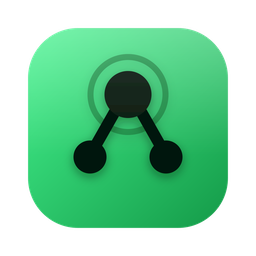
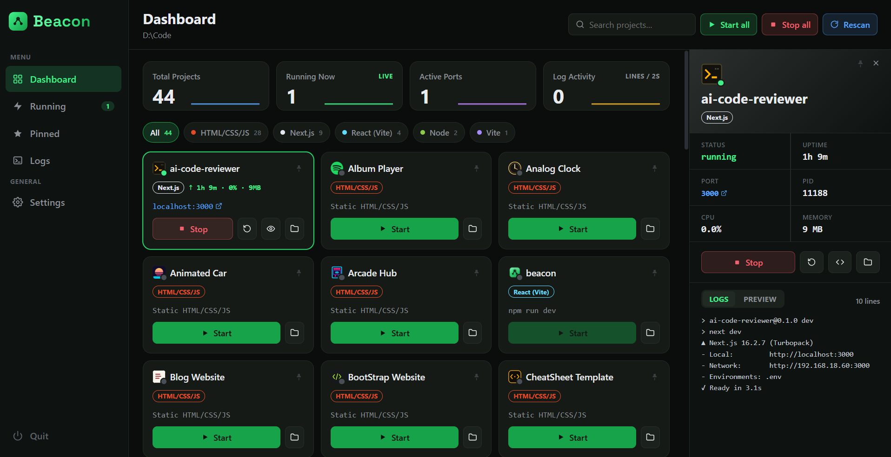

<div align="center">



# Beacon

**A local dev-server control center for Windows.**
Scan a folder, and Beacon finds every project inside it, launches the right dev server with the right package manager, and keeps a live dashboard of logs, ports, and resource usage — all without touching a terminal.

[](LICENSE)
[](#)
[](https://tauri.app)
[](https://www.rust-lang.org)
[](https://react.dev)
[](https://www.typescriptlang.org)



</div>

## What it does

Point Beacon at a folder full of side projects, and it takes care of the rest:

- 🔍 **Auto-discovery** — recursively scans for Node/npm projects and plain static HTML/CSS/JS sites, skipping `node_modules`, `dist`, `build`, `target`, and dotfolders along the way.
- 🧭 **Framework detection** — recognizes Next.js, Vite/React, Express, and more, and labels each project accordingly.
- 📦 **Package-manager aware** — reads `packageManager` (or falls back to the lockfile) and starts each project with the correct binary — npm, pnpm, yarn, or bun — instead of guessing.
- ▶️ **One-click start/stop/restart** — spawns the dev script, auto-detects the port it lands on, and streams stdout/stderr live.
- 🖼️ **Favicon everywhere** — pulls each project's real favicon, including inline `data:` URIs and Vite/CRA assets served from `public/`.
- 🌐 **Zero-config static server** — plain HTML/CSS/JS projects with no build step get served instantly by a built-in local file server.
- 📊 **Live stats** — per-project CPU and memory usage, sampled efficiently (no full-system scans).
- 🔔 **Background & tray** — closing the window keeps servers running in the tray; get a native notification if something crashes or a port collides.
- 📌 **Pin, search, filter** — pin favorites, search by name, filter by framework or running state.
- ⌨️ **Keyboard accessible** — every interactive element is reachable and operable without a mouse.

## Tech stack

| Layer | Stack |
|---|---|
| Shell | [Tauri 2](https://tauri.app) (Rust) |
| UI | React 19 + TypeScript + Vite |
| Process management | Native Rust process spawning, no shell dependencies beyond your package manager |
| Styling | Hand-rolled CSS design system (spacing/radius/type scale, no framework) |

## Getting started

### Prerequisites

- [Node.js](https://nodejs.org) 18+
- [Rust](https://www.rust-lang.org/tools/install) (stable toolchain)
- Windows (the current target platform)

### Run in development

```bash
npm install
npm run tauri dev
```

### Build a production installer

```bash
npm run tauri build
```

The signed NSIS installer will be at `src-tauri/target/release/bundle/nsis/`.

## Project structure

```
beacon/
├── src/               React frontend (single-page dashboard)
├── src-tauri/         Rust backend — scanning, process management, tray, static server
└── .github/           README assets
```

## License

MIT — see [LICENSE](LICENSE).
